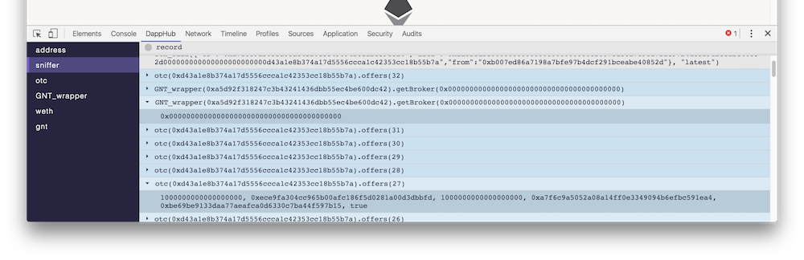
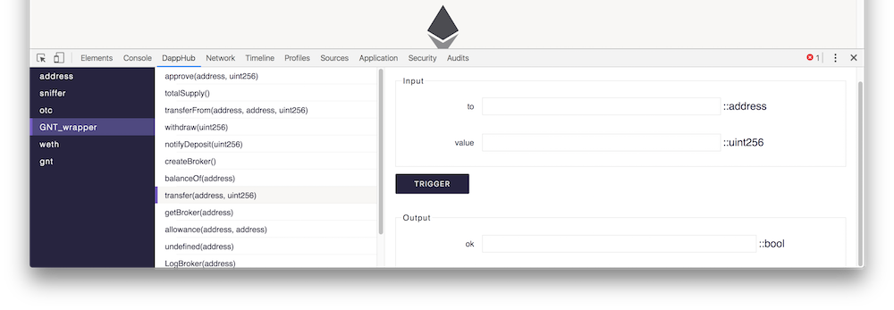

last update: 17.01.2017

## Development
#### SetUp:
clone this repo
open `chrome://extension` in chrome and Developer modus
Load the `dist` folder of this repo.

#### Develop
The current development is done on the Ropsten chain which has to be run in the background ((localhost:8545) e.g. with parity:
`parity --chain ropsten --rpc`) together with `https://mkr.market`

Try to keep this extension disabled when you don't use or develop it, for now.

If you modified something or experience errors restart the extension:

  1. close the dev-tool-panel view
  2. navigate to `chrome://extension`
  3. reload DappHub
  4. open the dev-tool-panel in your dapp web page
  5. reload the webpage

TODO: simplify this

buld the sources with `webpack --watch`

## Architecture

There are 3. Major contexts:

  1. dapp-webpage
  2. background
  3. dev tool panel

Note: all `src/` prefixed files are compiled through webpack into `dist/[name].bundle.js`

### 1. dapp-webpage

#### `src/content.js`:
This is the main script file which is injected into the webpage
and can access the dapps `window` object.
Its main capabilities are to inject DHE into the webpage (inject itself between the dapp and local web3 object).
The injector rerotes all web3 calls to DHE through message passing over `dist/inject.js`.

#### `dist/inject.js`:
This file lives in the dapp webpage but can **not** access the dapps window object.
Its main capabilities are to inject the `src/content.js` file into the dapp webpage which can access the local window object.

### 2. background

#### `src/background.js`:
This is the main background process. It lives in the chrome-extension background page regardless of the use of DHE extension.

Its capabilities are orchestrating registred extensions/ managing testrpc(ethereum client)/ routing between `dist/inject.js`, `src/testrpc.js` and `dist/devtools.js`.

#### `src/testrpc.js`:
Manages the run of a full ethereum client based off of ethereumjs-testrpc.
Capabilities are: providing a rpc endpoint for a forked chain, managing persistant storage.

#### `dist/devtools.js`:
This builds the dev-tools-panel view and routes between `src/background.js` and `src/main.js`

### 3. dev tool panel

#### `main.js`:
Main entrypoing for the dev-tools-panel view.

## Resources

#### Project

  * https://github.com/nexusdev/DHE
  * https://github.com/nexusdev/DHE-API
  * https://github.com/nexusdev/dapple-pkg

#### Frontend
  * [Intro into cycle.js](https://egghead.io/courses/cycle-js-fundamentals)
  * [cycle.js docs](https://cycle.js.org/getting-started.html)
  * [cycle.js isolate](https://github.com/cyclejs/cyclejs/tree/master/isolate)
  * [cycle.js onionify](https://github.com/staltz/cycle-onionify)
  * [cycle.js drivers](https://cycle.js.org/drivers.html)
  * [xstream](https://github.com/staltz/xstream)

# TODOs

  * custom contract view

## won't Do:
  * address view - deploy new instances

## Changelog

  * reset filters once a frontend disconnects
  * toggle fork/ forward transactions to real blockchain
  * settings - main account/ current fork
  * fork reset
  * **resolve testrpc bug where accounts don't get updated**
  * make web3 calls in address view work
  * make use of original web3 object as a fork provider
      with this metamask works for forking chains

# Screenshots

